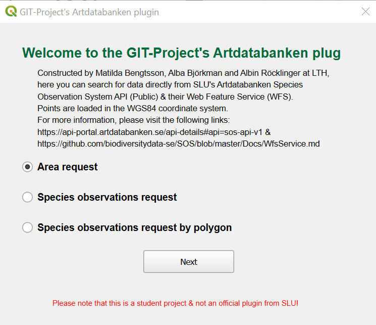
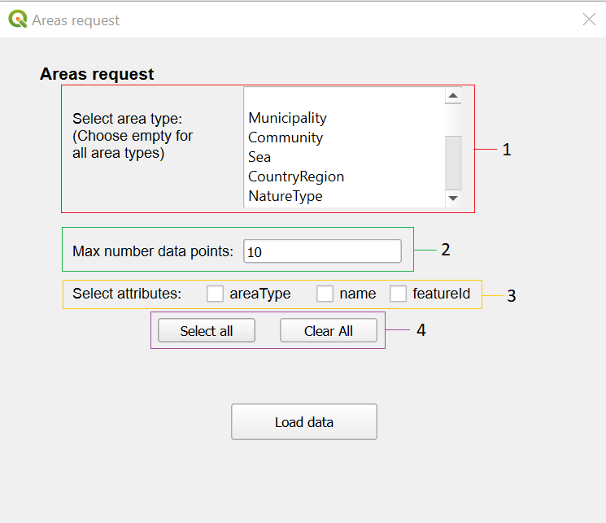
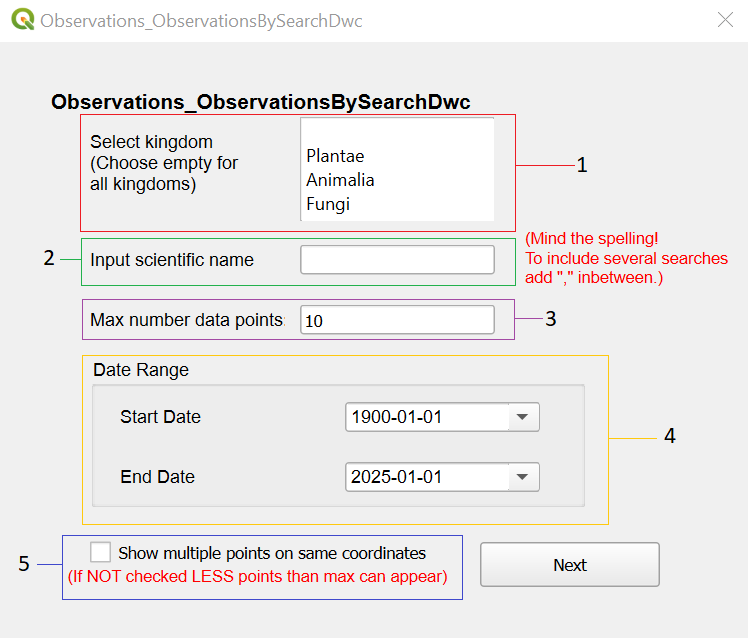
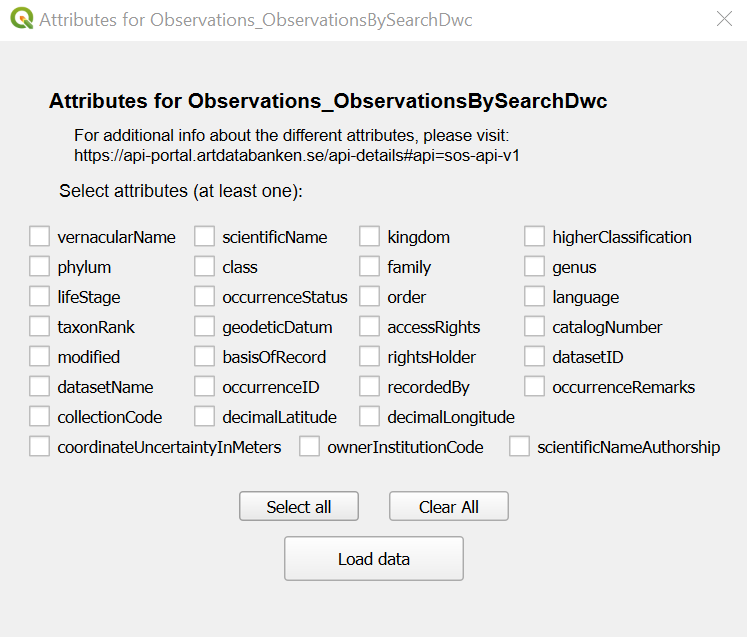
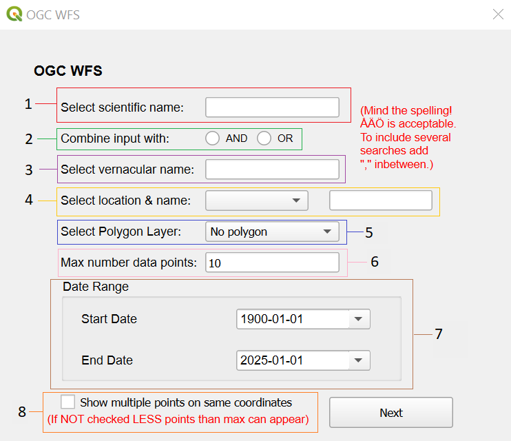
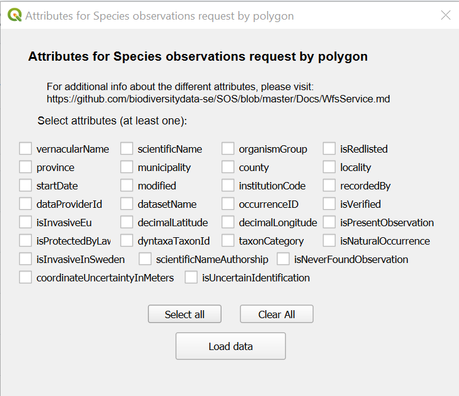

# Artdatabanken QGIS Plugin ReadMe
Unofficial plugin for extracting data from the Swedish Artdatabankens database.\
Created by **Matilda Bengtsson, Alba Björkman and Albin Röcklinger**, in the course EXTP40 - GIT Project with Python Programming, at Lund University in 2024/2025.  

The license  is under the terms of the GNU General Public License (GPL), either version 2 of the License or any later version if the user wishes. The program is free software that can be redistributed and/or modified. GPL requires the source code to be available to anyone who receives the software, this ensures transparency and allows others to improve the program.

## Introduction 
Geospatial data analysis is essential for biodiversity and used for urban planning, and today this is not included in a good way to QGIS which is a way to visualize solutions and spatial information. The integration of the Swedish Artdatabankens, which provides species observations, datasets and a program like QGIS will make this process easiest for  municipalities or other institutions. The aim of this project was to integrate parts of SLU's Artdatabanken into the open source GIS tool QGIS.   

The development of this was achieved through Python, tools like QGIS Plugin builder and QT designer alongside using API and WFS that Artdatabanken provided. The results gave the user the possibility to retrieve information about observations and areas in Sweden with options of what type of attributes, searches and filtering on areas with the help of polygon layers. 
      
# Plugin Structure
The plugin consists of three different request which utilizes either APIs available at Artdatabanken, getAreas and ObservationsSearchByDwc, or the Species Observation System (SOS) WFS Service.  
## Initial window
The window includes a selection that can be made between three different types of output: regions, species observations and WFS.  

 
Links on dialog window are:
 
[API information](https://api-portal.artdatabanken.se/api-details#api=sos-api-v1)
 
[WFS information GITHUB](https://github.com/biodiversitydata-se/SOS/blob/master/Docs/WfsService.md)

### Overall information about input
The plugin allows for case-insensitive input, meaning capital letters don’t matter, and it supports letters like Å, Ä, and Ö. To search for multiple items, use a comma (,) between each species. Spelling is critical for accurate results, so ensure inputs are correct. The calendar works from 1752 onward, though Artdatabanken offers older data. By default, criteria are combined with an “AND” unless stated otherwise.

## Areas request
Output is in the form of points which show the locations of different area classifications in Sweden.  

**Item 1**: Selection window, the different area types created by Artdatabanken can be found here. More than one option can be chosen and for all area types, choose the empty box on the first row.   
**Item 2**: Input box for the amount of observations the user wants output.    
**Item 3**: Checkboxes for specifying which attributes the user wants the point objects to contain.   
**Item 4**: Select/Clear all buttons, selects or clears all attribute checkboxes in **Item 3**. At least one checkbox needs to be marked.

## Species Observations request
The species observation dialog window which opens after selecting ObservationsBySearchDwc in the initial selection window. Output is in the form of points with data based on the criteria selected and the attributes chosen in the next step.  

**Item 1**: Multiple choice selection window where a user can select kingdoms, for all kingdoms select the empty box or none.  
**Item 2**: Optional text box for searching for specific flora and fauna through their scientific name, for example “Vulpes Vulpes” is a potential input.  
**Item 3**: Text box for amount of requested observations.  
**Item 4**: Date range interval input criteria for including observations within a specific time span.   
**Item 5**: Checkbox to allow for output of several observations on the same coordinates, will not output more than one observation for each coordinate pair unless this is checked.    
When pressing the **Next** the attributes selection will open. **Select all** and **Clear all** will mark and unmark all the checkboxes, and at least one attribute needs to be marked. The attributes selected here will be the ones included in the observation points. **Load data** will start the request to the API, this can take some time depending on the amount of max points. 

Link on dialog window is:
 
[Attribute information for Observations](https://api-portal.artdatabanken.se/api-details#api=sos-api-v1&operation=Observations_ObservationsBySearchDwc)

## WFS request

WFS window can be accessed through the initial selection window by selecting OGC WFS. WFS and Observations requests are similar in nature, but WFS allows for input of multipolygons objects as a filter. For this to work it is necessary to first add a new polygon layer in QGIS. 

**Item 1**: Optional input text box that allows for selection of observations of one or more species by their scientific names, example inputs being “vulpes vulpes” or “corvus corvus”.  
**Item 2**: Optional selection of which separation logic scientific and vernacular names should be parsed by.	 **AND** requires any observations to contain any input vernacular names and scientific names.  **OR** requires any observations to contain either any input vernacular names or scientific names. Default value is **AND**.  
**Item 3**: Optional input text box that allows for selection of observations of one or more species by their vernacular names in Swedish, example inputs being “räv” or “kråka”.   
**Item 4**: Optional selection of one or more localities, municipalities, counties or provinces of and add the same for the searches in the text input.
**Item 5**: Optional selection of a QGIS polygon layer that limits observations that **INTERSECT**S the geographical area.   
**Item 6**: Input text box for maximum amount of desired observations.  
**Item 7**: Desired date-range interval which limits output to the ones that were input during the time span.  
**Item 8**: Optional checkbox that, if checked, shows observations made at the same coordinates. If unchecked, any duplicate observations with the same coordinates are hidden and the amount of points can be less than the maximum number of observations.      

When all desired criterias are inputed and the **Next** button is clicked the attributes selection will open. Attributes selected will be the ones contained in each observation point that is loaded after **Load data** is pressed.  

Link on dialog window is:
 
[Attribute information for WFS](https://github.com/biodiversitydata-se/SOS/blob/master/Docs/WfsService.md#fields)
